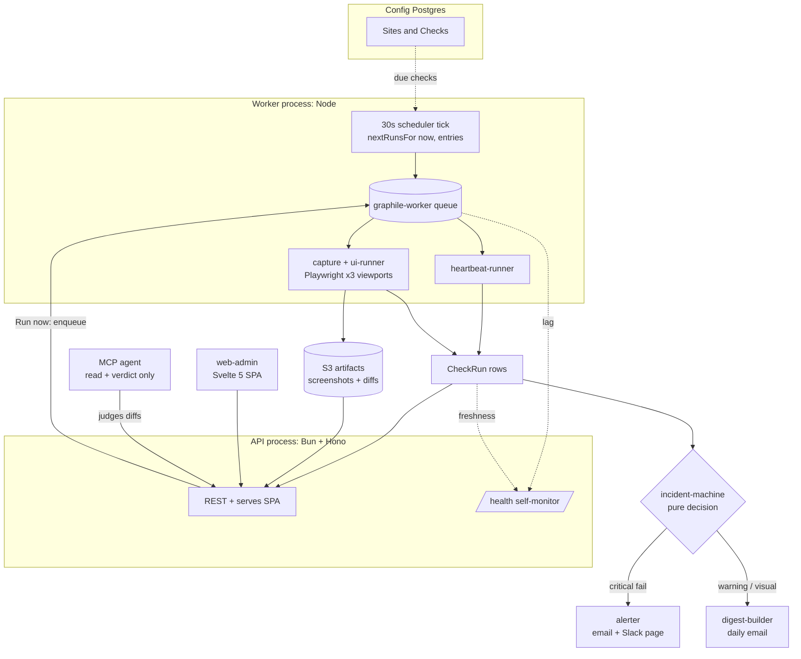

# Building Naikan: a website monitor, told through the forces that shaped it

I built Naikan by directing AI coding agents. The interesting part isn't *that*. It's
the scaffolding that kept it from becoming slop. Every feature began life as a
PRD, was sliced into independently-shippable [tracer-bullet issues](docs/mvp/issues/),
and every load-bearing decision was written down as an [ADR](docs/adr/) *before* the
code existed. The agent did the typing. The judgment about what to build, where the
seams go, and which trade-offs to accept is mine, and that's what this writeup is about.
(The "how I work with agents" mechanics are at the [end](#how-this-was-built); the system
comes first, because the system has to stand on its own.)

Naikan watches a portfolio of websites and tells you they broke before the client
does. Two families of check feed it: fast **heartbeat checks** (HTTP status, body
assertion, SSL expiry, and DNS, every few minutes) and daily **UI checks** (a real
browser at three viewports, a baseline screenshot diff, plus synthetic signals for
page-load, console errors, required selectors, and a Web-Vitals budget). Failures
either **page someone in realtime** or roll into a **daily digest**, and which one
fires is a deliberate decision, not an accident.

Rather than tour the folders, here's the system explained through the five forces that
actually shaped its structure. Each was a real constraint; each forced a decision with
a cost.



---

## Force 1: Playwright is unreliable on Bun, so the runtime had to split

I wanted one runtime. Bun is fast, the DX is great, and a single toolchain is simpler
to operate. But the worker drives **Playwright/Chromium**, and that's where the dream
died.

I ran a time-boxed spike before committing: a single `.mjs` harness, **50 iterations**,
each launching a *fresh* headless Chromium (cold-start every time, the harshest case
and the one a per-check worker actually hits), navigating to a local fixture, taking a
screenshot, reading console + navigation timing. The only variable was the JS runtime.

| 50 iterations | Bun 1.3.14 | Node 22.19 |
| --- | --- | --- |
| success | **46 / 50** | **50 / 50** |
| total wall-clock | **138 s** | **13 s** |

Bun failed **~8% of browser launches**, consistently around the ~22nd rapid
spawn/teardown, with `connect … ENOENT` thrown from inside Playwright's
`launchProcess`. The fault is Bun's `node:child_process` stdio-pipe shim failing to
establish the pipe to Chromium under churn. The wall-clock gap is the four 30s launch
timeouts. (Full numbers + harness: [ADR-0001](docs/adr/0001-worker-runtime.md).)

**Decision:** the worker runs on **Node**; the API stays on **Bun**. What makes a
two-runtime system tolerable instead of miserable is that the shared `packages/*`
kernel is **plain TypeScript with no Bun-specific APIs**, so the exact same domain
code imports cleanly under either runtime ([ADR-0005](docs/adr/0005-repo-layout.md)).
Node ≥ 22 strips the TS types natively, so the worker imports `.ts` kernel packages
with no build step.

**Trade-off:** two runtimes mean two mental models and the discipline to keep Bun-only
conveniences out of shared code (enforced at review, and structurally, via Force 5's
import fence). I paid that to buy reliability where it's non-negotiable and Bun's speed
where it's free.

**What I'd revisit:** re-run the spike as Bun's `child_process` shim matures; the
single-`dispatch`-style seams mean flipping the worker back to Bun would be a localized
change, not a rewrite.

---

## Force 2: A hero-image swap must never wake someone at 3am

Not every failure deserves a page. A down checkout endpoint does; a marketing team
swapping a hero image (which trips the visual diff) absolutely does not. Conflating
the two is how monitoring tools train people to ignore them.

So Naikan routes every failing signal to exactly one of two destinations:

- **Incident → page now.** A heartbeat that fails *N* consecutive runs opens an
  **Incident** and pages via the `alerter` (email + Slack, per-project routing). It
  auto-closes after **2 consecutive successes** and sends a "recovered after N minutes"
  alert.
- **Digest → tomorrow morning.** Visual diff regressions, console errors, and
  `warning`-severity signals never page. They roll into a **daily per-project digest**.

The dividing line is **severity**, encoded on each UI signal as `critical` (can page)
or `warning` (digest only). A UI check only opens an incident when a *critical* signal
fails. Its `CheckRun` records `critical_failed` (the paging signal) separately from
`status` (which fails on *any* regression, for the digest). A visual diff, no matter
how large, is digest-only by design.

The decision itself lives in a **pure** `@naikan/incident-machine`:
`evaluateIncident({ runs, open, alertAfterNFails }) → transition`. No clock, no DB; it
takes the recent run tail and the open-incident state and returns
`opened` / `still-open` / `closed-recovered(duration)`. A thin orchestrator runs it
after every `CheckRun` is written, in **both** the worker job and the API's "Run now"
path, so the rule has exactly one home.

**Trade-off:** this bakes a product judgment into the engine. A genuinely broken
layout that only manifests as a visual diff won't page you; you'll see it in the
morning digest. That's intentional (humans triage visual regressions; machines page on
hard-down), but it's a real choice, not a default.

**What I'd revisit:** the page-vs-digest routing is currently a fixed severity rule;
I'd make it configurable per check, and add flap-suppression for endpoints that
oscillate.

---

## Force 3: Retention must delete old runs but never touch a live baseline

UI checks are storage-hungry: 3 viewports × (baseline + current + diff) ≈ 9 PNGs per
check per day. A retention reaper has to delete aged run artifacts, but a **baseline**
is the approved reference every future diff compares against. Reap one by accident and
every subsequent run is meaningless.

The fix is structural, in the **S3 key layout** itself
([ADR-0002](docs/adr/0002-s3-key-convention.md)):

```
projects/<projectId>/checks/<checkId>/runs/<runId>/<viewport>.png       run screenshot
projects/<projectId>/checks/<checkId>/runs/<runId>/<viewport>.diff.png  run diff overlay
projects/<projectId>/checks/<checkId>/baseline/<viewport>.png           approved baseline
```

Baselines live **outside** the `runs/` subtree. So the reaper deletes everything under
`…/runs/` by prefix and *structurally* exempts `…/baseline/`. There's no per-object
"is this the current baseline?" lookup to get wrong. The **project-first prefix** makes
every per-project operation (retention windows, delete-on-offboard) a single prefix
scan rather than a table scan. Promote-to-baseline is just a copy from a run key to the
baseline key.

One small guard with outsized value: a single `artifactKeys` builder owns every key,
and it **throws** if an id segment is empty or contains a `/`. A malformed id can never
silently collapse the hierarchy and cross tenant boundaries.

**Trade-off:** encoding hierarchy in the key (not only in Postgres) couples the storage
layout to the domain shape. I accepted that because the bulk operations I actually care
about, retention and per-project deletion, become cheap prefix scans, and the invariant
("baselines are unreapable") is enforced by *structure*, which is the kind of guarantee
that survives a tired on-call engineer.

**What I'd revisit:** per-project buckets for hard tenant isolation and native lifecycle
policies, if this ever grew past one team's portfolio.

---

## Force 4: Daily browser checks are slow and flaky, so scheduling and execution must decouple

A heartbeat is milliseconds. A UI check launches a browser three times and can flake on
a slow third-party script. You can't run that work inline in a request, and you don't
want a missed tick or a crashed run to lose a check.

So the **scheduler** and the **executor** are separate, connected by a queue:

- The scheduler is a **pure** function: `nextRunsFor(now, entries)` returns which
  checks are due. No clock, no DB; both are passed in, which makes "is this check due?"
  a table-driven unit test instead of an integration test.
- A **30-second tick** in the worker asks the scheduler what's due and enqueues one job
  per check, **deduplicated by a `jobKey`** so a slow run never double-books.
- [**graphile-worker**](https://worker.graphile.org) (Postgres-backed) consumes jobs,
  with retries and a `WORKER_CONCURRENCY` cap. The job handler just runs the check and
  writes a `CheckRun`. **No scheduling logic lives in the handler**; the tick decides
  *when*, the handler decides nothing.

Using Postgres as the queue substrate means no extra infrastructure to operate; the
DB I already have *is* the broker. (graphile-worker owns its own schema, so app
migrations and queue tables never entangle.)

This split also gave the platform a way to **monitor itself**. `GET /health` is
unauthenticated (so an external uptime service can poll it) and asserts two things: the
oldest *waiting* queue job is younger than a threshold (a stalled worker lets jobs age),
and a `CheckRun` exists within a freshness window (a dead worker stops producing runs).
The external monitor that watches `/health` must use a **different alert channel** than
the per-project alerts, because a down platform can't send its own pages.

**Trade-off:** a second long-running process and a queue to operate, and "Run now" is
enqueue-then-poll rather than synchronous. In exchange, slow flaky work is isolated from
the API, retried on failure, and concurrency-bounded.

**What I'd revisit:** per-check concurrency classes and jittered retry for the flakiest
captures.

---

## Force 5: "Is this diff a real regression?" is a judgment call, so I gave it to an agent, carefully

A diff percentage over threshold doesn't mean *broken*. It might be anti-aliasing, a
rotating testimonial, a date that ticked over. Deciding real-vs-noise is judgment, and
it was the human bottleneck in triage. This is exactly the kind of fuzzy, visual,
context-heavy call an LLM is good at, so Naikan ships an **agent** that does it, behind
hard safety rails.

The platform exposes a **stdio MCP server** (`@naikan/mcp`) with four tools that walk an
agent from broad to specific: `list_ui_checks` → `list_ui_runs` → `get_ui_run`
(presigned baseline/current/diff image URLs + per-viewport diff% + signals + any
existing verdict) → `submit_verdict` (verdict kind, reasoning, confidence, model). The
judging procedure and the verdict taxonomy live in a bundled
[skill](.claude/skills/regression-judge/SKILL.md).

The rails are the point:

- **The token is scoped to read + verdict only.** It cannot run checks, promote
  baselines, or mutate config. It's also strictly **opt-in**: leave `NAIKAN_AGENT_TOKEN`
  unset and the platform boots with the agent disabled.
- **The agent advises; a human owns promote-to-baseline.** Nothing auto-promotes. The
  verdict surfaces as a badge in the run detail; the consequential, irreversible action
  stays with a person.
- **The judge is held to an eval.** A [golden dataset](docs/regression-judge/) of
  labeled diffs backs a `runEval(dataset, judge)` harness that reports accuracy, a 4×4
  confusion matrix, and per-label precision/recall/F1. A regression test gates the judge
  at **accuracy ≥ 0.70** and **skips loudly** (never silently passes) when no model key
  is present. The metric math is pure and unit-tested with a fake judge; the real judge
  uses Claude vision with structured output. Full writeup: [EVALS.md](EVALS.md).

**Trade-off:** LLM judgment is probabilistic and costs latency/money per call. That's
precisely why it's advisory-only, opt-in, behind a scoped token, and continuously
measured against a labeled set. The design assumes the judge is *fallible* and builds
the guardrails accordingly.

**What I'd revisit:** feed human overrides back into the golden set (active learning),
and calibrate the confidence score against observed accuracy.

---

## How this was built

The mechanics, now that the system has spoken for itself. Naikan was built
**spec-first, agent-executed, decision-logged**:

1. **PRD per feature.** [`docs/mvp/PRD.md`](docs/mvp/PRD.md), then
   [`docs/regression-judge/PRD.md`](docs/regression-judge/PRD.md): scope and non-goals
   before code.
2. **Tracer-bullet slices.** Each PRD was cut into thin, independently-shippable
   vertical slices ([19 for the MVP](docs/mvp/issues/), 6 for the agent feature), each
   one a working end-to-end increment, not a horizontal layer.
3. **A plan for the hard ones.** The trickier slices got a written
   [implementation plan](docs/plans/) before a line was written.
4. **ADRs for load-bearing decisions.** The six [ADRs](docs/adr/) capture the *why* of
   every choice in this document, with the options I rejected.
5. **Agents do the work, structure keeps them honest.** I drove this with Claude Code
   and a set of in-repo workflow skills (see [`AGENTS.md`](AGENTS.md) and
   [`.claude/skills/`](.claude/skills/)). The constraints that make the codebase
   AI-navigable are the same ones that make it *reviewable*: pure decision cores, the
   no-Bun-API kernel rule, and import fences that keep Playwright out of the API.

I owned the architecture, the trade-offs, the reviews, and the decision records; the
agent owned the typing. The regression-judge feature is the thesis in miniature: using
agents to build agent-judging infrastructure, then holding the result to an eval so the
automation can't quietly drift.

## What I'd change

- **No real production traffic yet.** This is a feature-complete MVP that runs as a
  full local stack; the AWS deploy was specced ([slice 19](docs/mvp/issues/19-aws-deploy.md))
  but isn't stood up. The honest claim is "designed and built," not "battle-tested."
- **Auth is intentionally thin:** two flat roles (Admin/Viewer) with managers scoped on
  read. Real multi-tenant RBAC was out of MVP scope.
- **The per-force revisits above** (configurable alert routing, per-check concurrency,
  per-project buckets, active-learning for the judge) are the natural v2.

---

*The full decision trail (ADRs, PRDs, plans, and the slices each feature was cut
into) lives in [`docs/`](docs/). Start at [`docs/README.md`](docs/README.md).*
